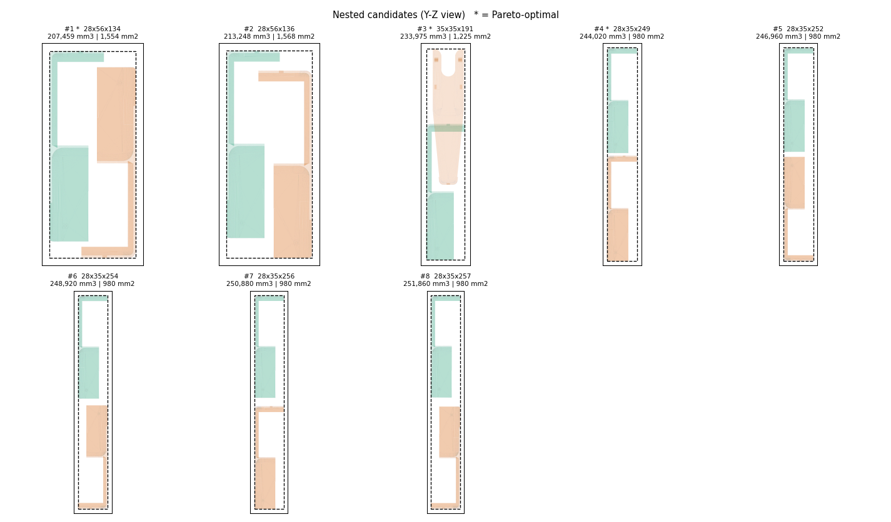

# STL Nesting Service

Upload an STL, get back the top *N* ways to arrange **two copies** of that part
in the smallest bounding box, with a guaranteed minimum surface-to-surface
clearance. Each arrangement comes with an isometric preview, downloadable
top / bottom / front views, and the nested STL.



---

## Quick start

```bash
git clone <this repo> && cd nesting-app
pip install -r requirements.txt
python app.py                  # serves on http://localhost:8000
```

```bash
python app.py --port 8080      # any other port
python app.py --host 0.0.0.0   # reachable from other machines
python app.py --reload --open  # restart on edits, open a browser
python app.py --help           # all options
```

On Linux/macOS, `./run.sh` does the same thing but creates `.venv` and
installs dependencies first. Any arguments are passed through to `app.py`.

Command line, no server:

```bash
python cli.py part.stl -n 10 -o results/
python cli.py --describe            # list every algorithm in the registry
```

Run the end-to-end test (uploads `data/sample.stl`, checks every endpoint):

```bash
python -m tests.test_smoke
```

---

## What you get per run

| Artefact | Where |
|---|---|
| `*_nest_01.stl` … `*_nest_10.stl` | one nested pair per recommendation |
| isometric preview | rendered eagerly, shown in the results grid |
| top / bottom / front PNGs | rendered on demand, **"2D views"** button → ZIP |
| `recommendations.json` / `.md` | metrics, transforms, audit, validation results |
| `all.zip` | everything at once |

---

## API

| Method | Path | Purpose |
|---|---|---|
| `POST` | `/api/jobs` | upload an STL → `{job_id}` |
| `GET` | `/api/jobs/{id}` | status, progress, log, recommendations |
| `GET` | `/api/jobs/{id}/rec/{rank}/image/{view}` | PNG; `iso`, `top`, `bottom`, `front`, `back`, `left`, `right` |
| `GET` | `/api/jobs/{id}/rec/{rank}/stl` | download that arrangement |
| `GET` | `/api/jobs/{id}/rec/{rank}/views.zip` | top + bottom + front + combined sheet |
| `GET` | `/api/jobs/{id}/all.zip` | every STL, preview and the report |
| `GET` | `/api/jobs/{id}/report` | full JSON report |
| `GET` | `/api/algorithms` | the algorithm registry |
| `DELETE` | `/api/jobs/{id}` | delete a job and its files |

Interactive docs at `/docs`.

```bash
curl -F file=@part.stl -F clearance=5 -F top_n=10 -F profile=quick \
     http://localhost:8000/api/jobs
```

---

## Options

| Option | Values | Notes |
|---|---|---|
| `clearance` | float | minimum surface gap, **in the STL's own units** — STL carries no unit information |
| `top_n` | 1–20 | how many arrangements to return |
| `profile` | `quick` · `standard` · `full` | search breadth; see timings below |
| `objective` | `volume` · `footprint` · `balanced` · `height` | what "best" means |
| `refiner` | `none` · `descend` · `profile` | how hard to squeeze toward the exact clearance |

**Timings** (single core, 4k-triangle part): `quick` ≈ 1–3 min · `standard`
≈ 10 min · `full` adds a 744-orientation SO(3) sweep. Cost scales with
`top_n`, since each candidate needs its own sample set and KD-trees.

---

## How it works

```
upload → audit (gate) → self-tests (gate) → coarse orientation sweep
       → fine sweep → diversify → refine each → export → verify → render
```

1. **Voxelise** by z-scanline parity fill on a shared lattice — exact solid
   occupancy, 0.18% volume error at 0.5 mm.
2. **Dilate** copy A by the clearance with a Euclidean distance transform, so
   "keep 5 mm apart" becomes a binary overlap test.
3. **Search translations** by FFT correlation. One transform evaluates *every*
   lattice translation, so the translation optimum is global for each rotation.
4. **Sweep rotations**, then refine locally around the winner.
5. **Refine continuously** against exact point-to-triangle distance, recovering
   the slack the deliberately conservative lattice search left behind.
6. **Verify** by reloading the written file and re-measuring with a fresh seed.

Full algorithm documentation lives in `app/core/nesting3d.py`; the registry of
what was used, what is kept only as a cross-check, and what was measured and
rejected is in `app/core/nesting_factory.py`.

### Why several recommendations

Minimum volume and minimum footprint are **different arrangements**. On the
sample part the volume optimum interlocks two uprights (205,440 mm³, 1,540 mm²
footprint) while the footprint optimum simply stacks them end to end (980 mm²,
but 251 mm tall and the worst volume available). Which you want depends on
whether you are filling a carton or a print bed, and geometry cannot tell you
that. So the service returns a diverse, Pareto-annotated set: rows marked
Pareto are not beaten on both volume *and* footprint simultaneously.

---

## Things worth knowing

**Loose fragments are stripped first.** Scanned and converted STLs arrive with
debris — a few triangles left by a boolean, a speck of scanner noise, a
duplicate shell offset from the part. It is not an error and nothing rejects
it: the mesh stays watertight and every check passes. What it does is stretch
the axis-aligned box that every reported number is measured against, so the
nesting silently optimises for mostly empty air. In one test three 0.5 mm
specks inflated the bounding box **38.8x**.

A fragment counts as debris when its bounding-box diagonal is under 5% of the
largest fragment's — physical size, because that is what the bounding box
responds to, rather than volume, which is undefined for the open shells debris
often is. The threshold is deliberately timid, so a genuine two-piece assembly
exported as one file keeps both pieces. Tune with `denoise_ratio`, disable with
`denoise=False`.

**No triangle ceiling.** `NEST_MAX_FACES` defaults to 0, meaning uploads are
never rejected for face count. Cost scales with it across sampling,
rasterisation and BVH construction, so a multi-million-face part is slow rather
than refused — set the variable to a positive number to restore a hard limit.

**Open meshes are repaired, then verified.** Solid voxelisation by parity is
undefined for an open surface — on a column that sees a hole the fill runs past
the boundary and returns a wrong solid with no error at all. So an upload that
is not a closed solid goes through `app/core/mesh_repair.py` first: weld
duplicate vertices, drop degenerate and duplicate faces, agree the winding,
fill the remaining holes, fix inverted normals. If that produces a closed solid
the job runs normally and the repaired STL replaces the uploaded copy, so the
results match the geometry on disk; the repair is reported in the job log and
in `recommendations.json`.

Repairs are checked rather than trusted. `fill_holes` will cap a large opening
with a flat lid, giving a watertight mesh that is not the part, so a repaired
solid must have positive volume and fit inside its own convex hull. Pass
`--no-repair` to the CLI to refuse open meshes outright.

**What repair cannot mend gets rebuilt.** Some files are not nearly-solid and
never will be: an assembly exported as two dozen open shells, a part whose
seams were never knit. For those `MeshSolidify` rasterises the geometry into a
voxel grid, flood-fills the interior and emits the filled/empty boundary — a
surface that is closed and 2-manifold *by construction* rather than by repair.
The trade is fidelity: it is quantised to the grid, so every dimension rounds
outward by up to one voxel. That bound is reported (`solidify.error_mm`) and
the job log says plainly that the nested geometry is a rasterisation of the
input, because it is an approximation of the part rather than a repair of it.

It is a last resort, reached only where the run would otherwise abort, and it
refuses the same lies the repair path does: a flat sheet is not thickened into
a slab, and an opening too wide to bridge leaves a hollow husk rather than a
solid, which is detected and rejected. Pass `--no-solidify` to disable the
fallback, or `--solidify-pitch` to choose the grid yourself.

Standalone, without running a nesting job:

```bash
python solidify.py part.stl                  # -> part_solid.stl
python solidify.py part.stl --check          # report only, exit 1 if open
python solidify.py *.stl -d solids/          # batch
```

**`refiner=none` leaves gaps loose.** It keeps the conservative lattice pose —
still valid, just further apart than requested (6–12 mm where you asked for 5).
Use `descend` or `profile` to squeeze to a true 5.00. `profile` is the only one
that reliably finds the feasibility cliff where an interlock engages;
coordinate descent can settle on the wrong side of it.

**Verification is not uniform across ranks.** Ranks 1–3 are re-measured with
the exact point-to-triangle metric; the rest get a faster sampled check. The
`verified.gap_method` field records which. Don't read a rank-8 gap as being
held to the same standard as rank 1.

**Two copies only.** Extending to *N* is not a small change: the FFT oracle
assumes one fixed part and one mover, so *N* needs either sequential placement
against a growing occupancy grid (fast, greedy, no longer globally optimal) or
branch-and-bound over placement order.

**Not provably globally optimal.** The rotation grid is discrete and copy A is
pinned at identity, so global rotations of the pair are not searched. The
honest claim is "best found by a well-covered search."

**The engine is single-threaded, and that costs ~1.6x.** KD-tree queries used
to fan out across every core. Measured on the reference part's `quick` profile,
the fan-out is worth 24.7 s against 39.1 s serial — results identical to the
digit either way, so this was never a correctness question.

It is off anyway. Under a profiler the fan-out charges its time to
`_thread.lock.acquire` rather than to the function that caused it, which made
88% of a profile unattributable and hid where the work actually was; every
optimisation in the distance path was found only after turning it off. And one
job now uses one core, so `NEST_JOB_WORKERS` above 1 scales cleanly instead of
having each job contend with the others for the same cores. If you want the
1.6x back on a single-job machine, set `KD_WORKERS = -1` in
`app/core/nesting3d.py`.

**Two distance backends.** The surface-to-surface distance is the whole cost of
a run — 79% of the wall clock — so it is pluggable. `sampled` (the default)
draws ~10^5 points per surface and searches KD-trees; its cost is set by the
sampling density, which is also what bounds its bias. `bvh` needs the optional
`python-fcl` and answers the mesh question directly by hierarchy traversal:
exact, no sampling bias, and it prunes to the geometry near contact instead of
enumerating points.

Measured on `data/sample.stl`, quick profile, ten recommendations:

| backend | run | per evaluation | agreement |
|---|---|---|---|
| `sampled` | 42.0 / 45.8 s | 164 ms | incumbent |
| `bvh` | 10.1 / 10.2 s | 2.4 ms | 8.9e-16 mm |

Same ten arrangements in the same order; volumes move by at most 0.08% because
the inner feasibility test gets the true distance instead of a slight
over-estimate. Select it with `--distance-backend bvh`, the **Distance** menu
in the UI, or `NEST_DISTANCE_BACKEND=bvh`. Without `python-fcl` installed the
option disappears from the UI and selecting it fails with an install hint.

**Part A is sampled once per job.** Every candidate measures the same fixed
part against a differently rotated copy, so `SurfaceSampleCache` holds its
surface samples and KD-tree for the length of the job — 11 of 42 tree builds
on a ten-candidate run. The cache lives in thread-local state and is dropped
when the job ends, and is keyed on mesh content, so an edited mesh cannot hit
a stale entry.

**Jobs are in-memory.** Restarting the server loses job records, though files
survive under `data/jobs/`. For production, back `JobStore` with Redis or a
database and move rendering to a task queue.

---

## Configuration

Environment variables, all optional:

```
NEST_DATA_DIR        job artefact directory      (default data/jobs)
NEST_MAX_UPLOAD_MB   upload size limit           (300)
NEST_MAX_FACES       triangle limit, 0 = none    (0)
NEST_JOB_WORKERS     concurrent jobs             (1)
NEST_DISTANCE_BACKEND sampled | bvh              (sampled)
NEST_JOB_TTL_HOURS   artefact retention          (24)
NEST_DEFAULT_PROFILE quick | standard | full     (quick)
NEST_RENDER_DPI      PNG resolution              (110)
```

---

## Layout

```
app/
  main.py              FastAPI routes
  jobs.py              job store, worker pool, progress bridge
  renders.py           painter's-algorithm iso + orthographic renderer
  config.py            settings
  core/
    nesting3d.py       all geometry algorithms as classes
    nesting_factory.py registry + factory
    nest_base.py       recommendation driver
  templates/index.html
  static/{app.js,style.css}
tests/test_smoke.py    end-to-end: upload → poll → fetch every artefact
cli.py                 command-line entry point
```

Rendering uses a painter's algorithm rather than an interactive 3D backend:
servers have no GPU, and matplotlib's mplot3d does not depth-sort reliably
across two interpenetrating bodies — parts of the rear copy leak in front of
the near one, which on a nesting result reads as a broken interlock.

## Licence

MIT.
